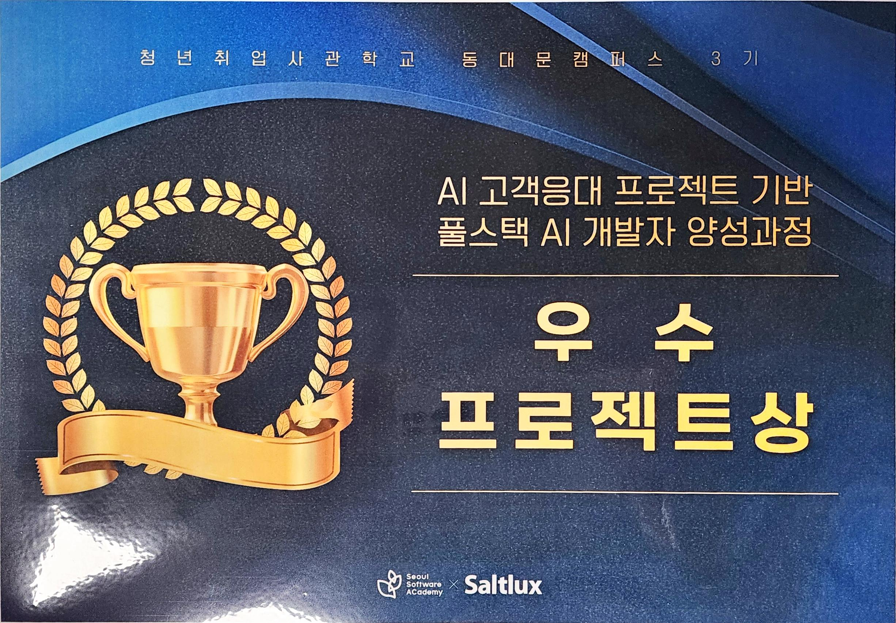
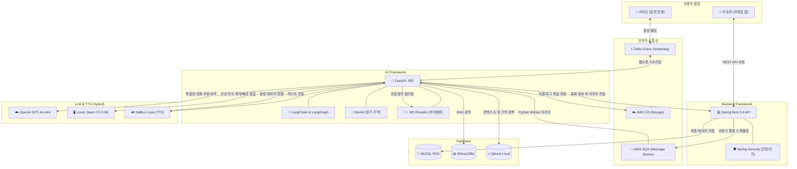
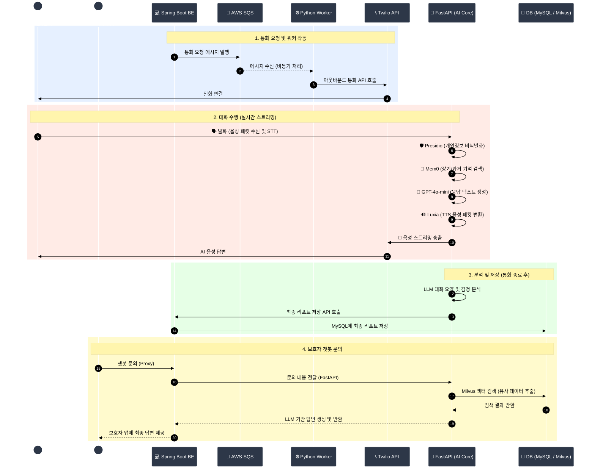

    
# SilverLink (실버링크)
    
독거 어르신의 일상을 기록하고, 보호자와의 연결을 돕는 AI 돌봄 콜봇 서비스

어르신들의 일상 기록 단절 문제를 해결하고, 응급 상황 발생 시 보호자 및 상담사에게 즉각적인 연결을 제공하여 골든타임을 확보하는 AI 솔루션입니다.

 
 

## 목차
- [개요](#개요)
- [기획 배경](#기획-배경-why-we-built-this)
- [기대 효과](#기대-효과-what-we-aim-to-achieve)
- [주요 기능 및 서비스](#주요-기능-및-서비스)
- [기술 스택](#기술-스택tech-stack)
- [시연 영상](#시연-영상)
- [서비스 주요 플로우](#서비스-주요-플로우)
- [시스템 아키텍처](#시스템-아키텍쳐system-architecture)
- [사용자 시나리오](#사용자-시나리오user-flow)
  

## 개요
- **개발 기간:** 2025/12/12 - 2026/02/08 (약 3주)
- **팀 구성:** 6명 (Cloud, 프론트엔드, 백엔드, AI)
- **주최:** 새싹 X 솔트룩스 AICC 풀스택 과정
- **수상:** 우수 프로젝트상(대상) 수여

   

## 기획 배경 (Why we built this)
현재 독거 어르신 돌봄 환경은 물리적인 거리와 돌봄 인력의 부족으로 인해 치명적인 사각지대에 놓여 있습니다. 본 프로젝트는 현장의 세 가지 핵심 페인 포인트(Pain Points)를 해결하기 위해 시작되었습니다.

**일상 기록의 단절**

매일의 식사, 복약, 수면 등 필수적인 일상 정보가 데이터화되지 않아 질병의 전조 증상이나 건강 변화 패턴을 추적하고 관리하기 어렵습니다.

**골든타임 확보의 위기** 

예기치 못한 건강 악화나 응급 상황 발생 시, 보호자나 담당 상담사에게 즉각적으로 상황이 전달되지 않아 대응이 늦어지는 위험이 존재합니다.

**사회적 고립과 우울감**

단순한 생사 확인을 넘어, 어르신의 감정을 어루만져 주고 일상을 나눌 수 있는 따뜻한 대화 상대가 턱없이 부족합니다.
   

## 기대 효과 (What we aim to achieve)

SilverLink는 단순한 자동 안부 전화를 넘어 기술을 통해 단절된 가족과 사회를 다시 연결하는 것을 목표로 합니다.

**정서적 고립 해소 (어르신)** 

어제 나눈 대화를 기억하고 먼저 안부를 묻는 '세상에 단 하나뿐인 전담 AI'와의 교감을 통해 독거노인의 우울감을 완화하고 활력을 제공합니다.

**데이터 기반의 연속적 돌봄 (보호자/상담사)**

통화 내용을 바탕으로 '3줄 요약, 감정 분석, 건강 태그(#두통, #식사거름 등)'가 포함된 실행형 리포트를 매일 제공하여 끊김 없는 맞춤형 건강 관리를 가능하게 합니다.

**스마트 안전망 구축 (시스템)** 

대화 중 우울감이나 건강 이상 징후가 감지될 경우, 시스템이 즉각적으로 보호자 앱에 알림을 전송하여 신속하게 골든타임을 확보할 수 있습니다.
   

## 주요 기능 및 서비스
**1. 스마트 예약 발신 (Smart Outbound Call)**
- **자동 안부 전화:** 시스템이 보호자가 설정해 둔 약속된 시간에 맞춰 어르신에게 먼저 전화를 겁니다.
- **안정적인 연결 대기열:** 여러 어르신에게 동시에 전화를 걸어야 하는 상황에서도, 누락이나 지연 없이 안정적으로 통화가 연결되도록 스케줄링 시스템이 작동합니다.

**2. 개인 맞춤형 실시간 대화 (Personalized Real-time Conversation)**
- **안전한 대화 환경:** 통화 중 어르신이 주민등록번호나 주소 같은 민감한 개인정보를 말씀하셔도, AI가 이를 즉시 감지하고 비식별화(가림 처리)하여 안전하게 보호합니다.
- **과거를 기억하는 교감:** "어제 병원 다녀오신 건 어떠셨어요?"처럼 이전 대화 내용을 기억하고 먼저 물어봐 주는 등, 단순한 기계가 아닌 전담 요양보호사처럼 대화합니다.
- **사람 같은 초저지연 소통:** 어르신의 말씀이 끝나기 무섭게 1.5초 이내에 즉각적으로 반응하며, 대화가 뚝뚝 끊기지 않고 자연스럽게 이어집니다.

**3. 데이터 분석 및 보호자 연동 (Analysis & Guardian Sync)**
- **통화 직후 요약 리포트:** 전화가 끊어지면 AI가 5~10분의 긴 대화를 3줄로 요약하고, 어르신의 감정 상태(우울감, 기쁨 등)와 건강 이상 징후를 분석해 보호자의 앱으로 즉시 전송합니다.
- **보호자 안심 챗봇 문의:** 보호자가 앱에서 "최근 일주일간 어머니 식사는 어떠셨어?"라고 질문하면, AI가 그동안 쌓인 통화 기록을 찾아내어 정확하고 상세하게 답변해 줍니다.
   

## 기술 스택(Tech Stack)
| **분류 (Category)** | **기술 스택 (Tech Stack)** | **주요 역할 (Role)** |
| :--- | :--- | :--- |
| **AI Framework** | FastAPI, LangChain, LangGraph | API 서빙 및 에이전트 대화 흐름 제어 |
| **Backend** | Spring Boot 3.4, Spring Security | 메인 비즈니스 로직 처리 및 보안/인증 |
| **LLM / SLM** | GPT-4o-mini / Qwen 2.5 0.5B | GPT(복잡한 대화 추론), Qwen(빠른 의도 분류) |
| **Database** | MySQL, Milvus, FAISS | MySQL(데이터 저장), Milvus(RAG 검색), FAISS(대화 기억) |
| **Communication** | Twilio, Saltlux Luxia, Google V2 | Twilio(실시간 전화 스트리밍), Saltlux(TTS), Google V2(STT) |
| **Infrastructure** | AWS SQS, AWS S3, Docker | SQS(메시지 큐잉), S3(파일 저장), Docker(환경 구축) |
| **Security/PII** | Microsoft Presidio | 대화 내용 중 민감한 개인정보 자동 마스킹 |

  

## 시연 영상

### [📹시연영상](https://screenapp.io/app/v/uaQPc0twLX)
  

## 서비스 주요 플로우
### 1. 어르신 등록

### 2. 보호자 등록

### 3. 상담사 배정

### 4. 개인 맞춤형 통화

### 5. 통화 분석 및 상담사 일지 작성

### 6. 보호자 확인

### 6. 응급 상황 및 알림

  

## 시스템 아키텍쳐(System Architecture)

  

## 사용자 시나리오(User Flow)

   1. 통화 요청:
       * Spring Boot BE → AWS SQS 발행.
   2. 워커 작동:
       * Python SQS Worker가 메시지 수신 → Twilio API 호출.
   3. 대화 수행:
       * 발화 감지 → Presidio(비식별화) → Mem0(기억 검색) → GPT-4o-mini(응답 생성) → Luxia(TTS 변환) → Twilio(음성
         송출).
   4. 분석 및 저장:
      * 통화 종료 후 LLM이 대화 요약 및 감정 분석 → Spring Boot API 호출하여 MySQL에 최종 리포트 저장.
   5. 챗봇 문의:
      * 보호자 앱 → Spring Boot(Proxy) → FastAPI Chatbot → Milvus 검색 및 답변 생성.
